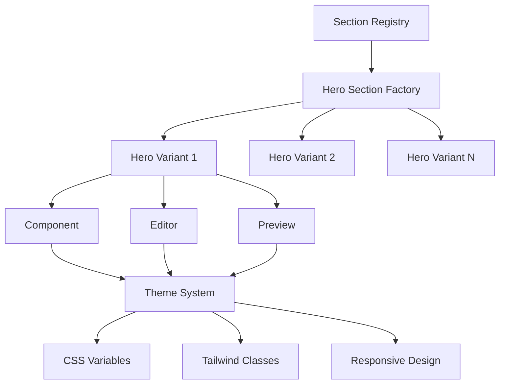

# Design Document

## Overview

This design document outlines the architecture and implementation approach for expanding the hero section system with 10 distinct variants, each featuring specialized editors and seamless theme integration. The solution builds upon the existing section registry system while introducing a modular, scalable architecture that maintains consistency with the current design system.

## Architecture

### Component Architecture

The hero sections expansion follows a three-tier architecture:

1. **Section Components** - Individual hero section implementations
2. **Editor Components** - Specialized configuration interfaces for each variant
3. **Registry Integration** - Centralized management and discovery system



### File Structure

```
lib/sections/hero/
├── index.ts                    # Main exports
├── registry.ts                 # Hero section configurations
├── types.ts                    # Shared TypeScript interfaces
├── utils.ts                    # Common utilities
├── variants/
│   ├── HeroCentered.tsx        # Centered layout variant
│   ├── HeroSplitScreen.tsx     # Split-screen layout variant
│   ├── HeroVideo.tsx           # Video background variant
│   ├── HeroMinimal.tsx         # Minimal design variant
│   ├── HeroFeature.tsx         # Feature-focused variant
│   ├── HeroTestimonial.tsx     # Testimonial-integrated variant
│   ├── HeroProduct.tsx         # Product showcase variant
│   ├── HeroService.tsx         # Service-oriented variant
│   ├── HeroCTA.tsx             # Call-to-action focused variant
│   └── HeroGallery.tsx         # Image gallery variant
├── editors/
│   ├── HeroCenteredEditor.tsx
│   ├── HeroSplitScreenEditor.tsx
│   ├── HeroVideoEditor.tsx
│   ├── HeroMinimalEditor.tsx
│   ├── HeroFeatureEditor.tsx
│   ├── HeroTestimonialEditor.tsx
│   ├── HeroProductEditor.tsx
│   ├── HeroServiceEditor.tsx
│   ├── HeroCTAEditor.tsx
│   └── HeroGalleryEditor.tsx
└── previews/
    ├── HeroCenteredPreview.tsx
    ├── HeroSplitScreenPreview.tsx
    ├── HeroVideoPreview.tsx
    ├── HeroMinimalPreview.tsx
    ├── HeroFeaturePreview.tsx
    ├── HeroTestimonialPreview.tsx
    ├── HeroProductPreview.tsx
    ├── HeroServicePreview.tsx
    ├── HeroCTAPreview.tsx
    └── HeroGalleryPreview.tsx
```

## Components and Interfaces

### Core Types

```typescript
// Base hero section interface
interface BaseHeroProps {
  id: string
  variant: HeroVariant
  theme: ThemeConfig
  responsive: ResponsiveConfig
  animation?: AnimationConfig
  accessibility: AccessibilityConfig
}

// Hero variant enumeration
enum HeroVariant {
  CENTERED = 'centered',
  SPLIT_SCREEN = 'split-screen',
  VIDEO = 'video',
  MINIMAL = 'minimal',
  FEATURE = 'feature',
  TESTIMONIAL = 'testimonial',
  PRODUCT = 'product',
  SERVICE = 'service',
  CTA = 'cta',
  GALLERY = 'gallery'
}

// Theme integration interface
interface ThemeConfig {
  primaryColor: string
  secondaryColor: string
  accentColor: string
  backgroundColor: string
  textColor: string
  borderColor: string
  fontFamily: string
  borderRadius: string
}

// Responsive configuration
interface ResponsiveConfig {
  mobile: ResponsiveBreakpoint
  tablet: ResponsiveBreakpoint
  desktop: ResponsiveBreakpoint
}

interface ResponsiveBreakpoint {
  layout: LayoutConfig
  typography: TypographyConfig
  spacing: SpacingConfig
}
```

### Individual Hero Section Specifications

#### 1. Hero Centered
- **Purpose**: Traditional centered hero with title, subtitle, and CTA
- **Layout**: Centered content with optional background
- **Key Features**: Text alignment options, multiple CTAs, background treatments
- **Editor Fields**: Title, subtitle, description, primary/secondary buttons, background (color/image/gradient), text alignment

#### 2. Hero Split Screen
- **Purpose**: Two-column layout with content and media
- **Layout**: 50/50 or customizable split with content on one side, media on other
- **Key Features**: Reversible layout, media type selection, content alignment
- **Editor Fields**: Content side (title, text, buttons), media side (image/video), layout direction, alignment options

#### 3. Hero Video
- **Purpose**: Full-screen video background with overlay content
- **Layout**: Video background with centered or positioned overlay
- **Key Features**: Video controls, fallback image, overlay opacity
- **Editor Fields**: Video file, fallback image, overlay content, video settings (autoplay, loop, muted), overlay position

#### 4. Hero Minimal
- **Purpose**: Clean, typography-focused design with minimal elements
- **Layout**: Simple centered text with subtle accents
- **Key Features**: Typography emphasis, minimal visual elements, whitespace focus
- **Editor Fields**: Headline, tagline, single CTA, typography settings, minimal background options

#### 5. Hero Feature
- **Purpose**: Showcase key features or benefits prominently
- **Layout**: Main content with feature highlights or icons
- **Key Features**: Feature list, icon integration, benefit highlighting
- **Editor Fields**: Main content, feature list (icon, title, description), layout style, feature display options

#### 6. Hero Testimonial
- **Purpose**: Social proof integration with hero content
- **Layout**: Main hero content with testimonial overlay or sidebar
- **Key Features**: Testimonial rotation, customer photos, rating display
- **Editor Fields**: Hero content, testimonial data (quote, author, company, photo), testimonial position, rotation settings

#### 7. Hero Product
- **Purpose**: Product showcase with detailed information
- **Layout**: Product image/gallery with descriptive content
- **Key Features**: Product gallery, pricing display, feature highlights
- **Editor Fields**: Product images, product name, description, price, features, gallery settings, CTA customization

#### 8. Hero Service
- **Purpose**: Service-oriented businesses with value proposition
- **Layout**: Service description with trust indicators
- **Key Features**: Service highlights, trust badges, contact integration
- **Editor Fields**: Service title, value proposition, service highlights, trust elements, contact CTA, trust badge uploads

#### 9. Hero CTA
- **Purpose**: Conversion-focused with prominent call-to-action
- **Layout**: Compelling copy with emphasized action elements
- **Key Features**: Multiple CTA styles, urgency indicators, form integration
- **Editor Fields**: Headline, persuasive copy, primary/secondary CTAs, urgency elements, form integration options

#### 10. Hero Gallery
- **Purpose**: Visual storytelling through image collections
- **Layout**: Image gallery with overlay content
- **Key Features**: Image carousel, lightbox integration, caption support
- **Editor Fields**: Image collection, gallery style, navigation options, overlay content, caption settings

## Data Models

### Hero Section Configuration

```typescript
interface HeroSectionConfig {
  id: string
  variant: HeroVariant
  name: string
  description: string
  icon: string
  category: 'HERO'
  defaultProps: Record<string, any>
  editorSchema: EditorSchema
  previewComponent: string
  editorComponent: string
  tags: string[]
  isActive: boolean
  version: string
  themeCompatibility: ThemeCompatibility
  responsiveSupport: ResponsiveSupport
}

interface EditorSchema {
  sections: EditorSection[]
  validation: ValidationRules
  dependencies: FieldDependency[]
}

interface EditorSection {
  id: string
  title: string
  fields: EditorField[]
  collapsible: boolean
  defaultExpanded: boolean
}

interface EditorField {
  id: string
  type: FieldType
  label: string
  placeholder?: string
  required: boolean
  validation?: ValidationRule[]
  options?: FieldOption[]
  dependencies?: string[]
  helpText?: string
}

enum FieldType {
  TEXT = 'text',
  TEXTAREA = 'textarea',
  RICH_TEXT = 'rich-text',
  SELECT = 'select',
  MULTI_SELECT = 'multi-select',
  BOOLEAN = 'boolean',
  NUMBER = 'number',
  COLOR = 'color',
  IMAGE = 'image',
  VIDEO = 'video',
  URL = 'url',
  BUTTON_GROUP = 'button-group',
  REPEATER = 'repeater'
}
```

### Theme Integration Model

```typescript
interface ThemeIntegration {
  cssVariables: CSSVariableMapping[]
  tailwindClasses: TailwindClassMapping[]
  customStyles: CustomStyleDefinition[]
  responsiveBreakpoints: ResponsiveBreakpoint[]
}

interface CSSVariableMapping {
  property: string
  cssVariable: string
  fallback: string
  themeKey: keyof ThemeConfig
}

interface TailwindClassMapping {
  condition: string
  classes: string[]
  responsive: boolean
}
```

## Error Handling

### Validation Strategy

1. **Client-Side Validation**
   - Real-time field validation during editing
   - Schema-based validation using Zod or similar
   - User-friendly error messages with suggestions

2. **Server-Side Validation**
   - Data integrity checks before persistence
   - Security validation for media uploads
   - Cross-field validation for complex dependencies

3. **Runtime Error Handling**
   - Graceful degradation for missing media
   - Fallback content for failed API calls
   - Error boundaries for component failures

### Error Recovery

```typescript
interface ErrorRecovery {
  fallbackContent: FallbackContent
  retryMechanism: RetryConfig
  userNotification: NotificationConfig
  logging: ErrorLogging
}

interface FallbackContent {
  defaultProps: Record<string, any>
  placeholderImage: string
  errorMessage: string
  recoveryActions: RecoveryAction[]
}
```

## Testing Strategy

### Unit Testing
- Individual component rendering tests
- Editor functionality validation
- Theme integration verification
- Responsive behavior testing

### Integration Testing
- Section registry integration
- Media picker integration
- Theme system compatibility
- Editor-to-preview synchronization

### Visual Regression Testing
- Screenshot comparison across themes
- Responsive layout verification
- Cross-browser compatibility
- Accessibility compliance testing

### Performance Testing
- Component render performance
- Media loading optimization
- Bundle size impact analysis
- Memory usage monitoring

## Performance Considerations

### Code Splitting
```typescript
// Dynamic imports for hero variants
const HeroCentered = lazy(() => import('./variants/HeroCentered'))
const HeroSplitScreen = lazy(() => import('./variants/HeroSplitScreen'))
// ... other variants

// Editor components loaded on demand
const loadEditor = (variant: HeroVariant) => {
  return import(`./editors/Hero${variant}Editor`)
}
```

### Asset Optimization
- Lazy loading for non-critical images
- WebP format with fallbacks
- Responsive image sizing
- Video compression and streaming

### Caching Strategy
- Component-level memoization
- Asset caching with service workers
- API response caching
- Build-time optimization

## Accessibility Implementation

### WCAG 2.1 AA Compliance
- Semantic HTML structure
- Proper heading hierarchy
- Alt text for all images
- Keyboard navigation support
- Screen reader compatibility
- Color contrast validation
- Focus management
- Motion preference respect

### Implementation Details
```typescript
interface AccessibilityConfig {
  ariaLabels: Record<string, string>
  keyboardNavigation: KeyboardConfig
  screenReader: ScreenReaderConfig
  colorContrast: ContrastConfig
  motionPreferences: MotionConfig
}
```

## Security Considerations

### Input Sanitization
- XSS prevention for rich text content
- URL validation for links and media
- File type validation for uploads
- Content Security Policy compliance

### Media Security
- File size limitations
- MIME type validation
- Malware scanning integration
- CDN security headers

## Migration Strategy

### Backward Compatibility
- Existing hero sections remain functional
- Gradual migration path for current implementations
- Version compatibility matrix
- Migration utilities and documentation

### Deployment Plan
1. **Phase 1**: Core infrastructure and base components
2. **Phase 2**: First 5 hero variants with editors
3. **Phase 3**: Remaining 5 variants and advanced features
4. **Phase 4**: Performance optimization and polish

## Monitoring and Analytics

### Performance Metrics
- Component render times
- Editor interaction analytics
- Media loading performance
- User engagement tracking

### Error Monitoring
- Component error tracking
- Editor validation failures
- Media loading failures
- Theme compatibility issues

This design provides a comprehensive foundation for implementing 10 diverse hero sections while maintaining consistency with the existing system architecture and ensuring optimal performance, accessibility, and user experience.